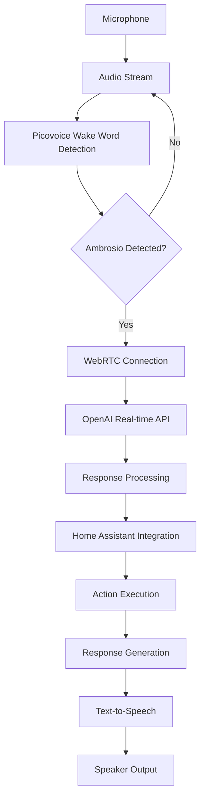

# Ambrosio Project Context

## Current Status

Ambrosio is a real-time voice assistant with the following implemented features:

- **Core Functionality**
  - WebRTC-based real-time audio streaming
  - OpenAI real-time API integration
  - Picovoice wake word detection ("Ambrosio")
  - Home Assistant API integration

- **Documentation**
  - Complete technical documentation suite
  - Implementation guides for all components
  - API reference documentation
  - Error handling strategies

## System Architecture

## Current Development Focus

1. **Performance Optimization**
   - Implement adaptive bitrate control
   - Add voice activity detection
   - Optimize resource usage
   - Implement failover mechanisms

2. **Error Handling**
   - Authentication error recovery
   - Network error retry logic
   - Service outage handling
   - User notification system

3. **Security Enhancements**
   - Token refresh mechanism
   - Credential rotation
   - Secure storage implementation
   - DTLS encryption verification

## Next Steps

### Phase 1: Core Functionality Completion
- Finalize WebRTC implementation
- Complete OpenAI integration
- Finish Home Assistant control module

### Phase 2: System Integration
- Implement monitoring dashboard
- Set up logging infrastructure
- Configure deployment pipeline
- Add CI/CD integration

### Phase 3: Optimization and Scaling
- Implement load testing
- Add horizontal scaling support
- Optimize resource usage
- Implement caching mechanisms

## Documentation Status

| Document | Status | Last Updated |
|----------|--------|--------------|
| IMPLEMENTATION_GUIDE.md | Complete | Today |
| SYSTEM_INTEGRATION.md | Complete | Today |
| HOME_ASSISTANT_INTEGRATION.md | Complete | Today |
| WEBRTC_IMPLEMENTATION.md | Complete | Today |
| OPENAI_INTEGRATION.md | Complete | Today |
| PICOVOICE_IMPLEMENTATION.md | Complete | Today |

## Development Environment

- **Primary Language**: JavaScript/TypeScript
- **Runtime**: Node.js 16.x
- **Dependencies**:
  - `@picovoice/porcupine-node`
  - `websocket`
  - `openai`
  - `home-assistant-js-websocket`

## Configuration Files

| File | Purpose |
|------|---------|
| `webrtc.config.json` | WebRTC server configuration |
| `homeassistant.config.json` | Home Assistant integration settings |
| `openai.config.json` | OpenAI API configuration |
| `picovoice.config.json` | Wake word detection settings |

## For the Next AI Worker

- **Immediate Focus**: Performance optimization tasks
- **Resources**: Refer to implementation guides
- **Communication**: Update CONTEXT.md with progress
- **Documentation**: Maintain comprehensive documentation
