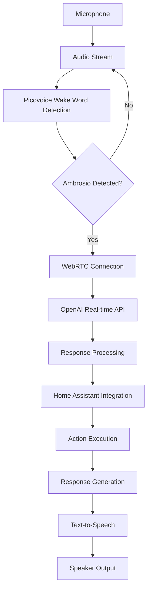

# Ambrosio Implementation Guide

This document outlines the implementation strategy for the Ambrosio voice assistant system.

## System Architecture

## Key Components

### 1. Wake Word Detection
- Uses Picovoice with custom "Ambrosio" wake word
- European Portuguese language support
- Low-latency detection
- Background operation

### 2. WebRTC Implementation
- Real-time audio streaming
- STUN/TURN server configuration
- DTLS encryption
- Adaptive bitrate control

### 3. OpenAI Integration
- Real-time voice processing
- Natural language understanding
- Contextual conversation management
- Response generation

### 4. Home Assistant Control
- Device state monitoring
- Automation triggering
- Real-time event streaming
- Secure API integration

## Implementation Phases

### Phase 1: Core Functionality
1. Implement wake word detection
2. Set up WebRTC audio streaming
3. Integrate OpenAI real-time API
4. Add basic Home Assistant control

### Phase 2: System Integration
1. Implement error handling and recovery
2. Add performance monitoring
3. Set up security measures
4. Configure deployment pipeline

### Phase 3: Optimization
1. Implement adaptive bitrate control
2. Add voice activity detection
3. Optimize resource usage
4. Implement failover mechanisms

## Configuration Management

| Component | Configuration File | Key Parameters |
|-----------|--------------------|----------------|
| Picovoice | .env | ACCESS_KEY, MODEL_PATH |
| WebRTC | webrtc.config.json | STUN_SERVERS, TURN_SERVERS |
| OpenAI | openai.config.json | API_KEY, MODEL_NAME |
| Home Assistant | homeassistant.config.json | API_URL, ACCESS_TOKEN |

## Error Handling Strategy

1. **Authentication Errors**
   - Token refresh mechanism
   - Credential rotation
   - Secure storage

2. **Network Errors**
   - Exponential backoff retry
   - Failover to backup servers
   - Connection monitoring

3. **Service Errors**
   - Circuit breaker pattern
   - Graceful degradation
   - User notifications

## Next Steps

1. Implement core functionality components
2. Set up integration tests
3. Configure monitoring dashboard
4. Optimize system performance
