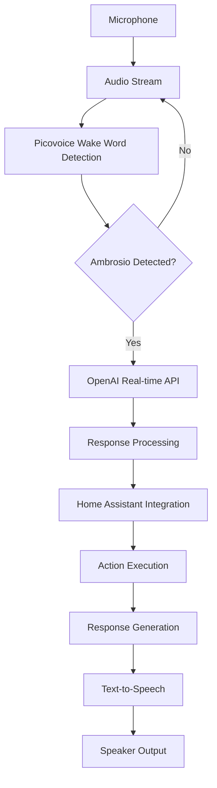

# Ambrosio System Integration

This document outlines the integration of all key components in the Ambrosio system.

## System Architecture

## Component Integration

### 1. Picovoice Wake Word Detection
- Handles wake word detection
- Triggers voice session
- Manages audio stream

### 2. OpenAI Real-time API
- Processes voice commands
- Generates responses
- Manages conversation context

### 3. Home Assistant Integration
- Controls smart home devices
- Retrieves device status
- Executes automation routines

### 4. Text-to-Speech
- Converts text responses to speech
- Manages voice characteristics
- Handles audio output

## Data Flow

1. **Wake Word Detection**
   - Audio stream → Picovoice → Wake word detection

2. **Command Processing**
   - Detected speech → OpenAI API → Intent recognition

3. **Action Execution**
   - Recognized intent → Home Assistant → Device control

4. **Response Generation**
   - Action result → OpenAI API → Response generation

5. **Output**
   - Generated response → Text-to-Speech → Audio output

## Error Handling

| Component | Error Type | Handling Strategy |
|-----------|------------|-------------------|
| Picovoice | Audio device failure | Retry initialization |
| OpenAI API | Network error | Exponential backoff |
| Home Assistant | Device unavailable | Fallback response |
| Text-to-Speech | Audio output failure | Retry or notify |

## Performance Monitoring

| Metric | Target | Monitoring Strategy |
|--------|--------|---------------------|
| Wake word detection latency | < 500ms | Real-time monitoring |
| OpenAI API response time | < 2s | API call tracking |
| Home Assistant response time | < 1s | Device status tracking |
| System uptime | > 99.9% | Health checks |

## Next Steps

1. Implement integration tests
2. Add monitoring dashboard
3. Optimize resource allocation
4. Implement failover mechanisms
